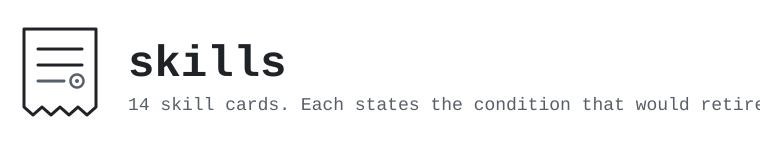

<p>
  <picture>
    <source media="(prefers-color-scheme: dark)" srcset="assets/banner-dark.svg">
    
  </picture>
</p>

# skills

```bash
npx skills add MrBinnacle/skills
```

## The question I started with

> It's just - the most successful mistake of mine so far. I think..maybe

— 2026-08-12, [the record](VERBATIM.md)

Every first-person line quoted on this page is in that file, with the date it was said. The rule
behind it: a quoted line has to be one the principal wrote, cited to the record — never one read
back off a page.

The question underneath it was whether you can tell if a skill is any good.

> I wanted to know if you could tell if a skill was good. Etc and so forth. Expand expand expand.
> And then this happened.

— 2026-08-12, [the record](VERBATIM.md)

A skill is a small markdown file that tells an assistant how to handle a particular situation.
"This" is two public repositories: this one holds the skills, and
[skill-harness](https://github.com/MrBinnacle/skill-harness) is the instrument built to answer the
question about them. Measured on 2026-08-13, that stands at **66 commits of collection against 323
commits of machinery built to find out whether the collection is worth anything**:

```bash
git clone https://github.com/MrBinnacle/skills.git        && git -C skills        rev-list --count HEAD
git clone https://github.com/MrBinnacle/skill-harness.git && git -C skill-harness rev-list --count HEAD
```

The basis is a fresh clone at `HEAD` — what a plain `git clone` gets you — so those two commands
are the whole claim, and you can land on the same figures yourself, give or take what has merged
since. On that same basis the first commit here is 2026-05-24 and the first commit there is
2026-06-03: the collection came first, by ten days. The cards came out of learning to do the work,
and the wondering turned into an instrument afterwards.

The question is still open. Every card here reads `UNMEASURED` in its controlled fields, which is
what the next section is about.

> Im wrong  like 200x a day - but i can iterate in really cool ways fast enough to cancel out the
> wrongness

— 2026-08-12, [the record](VERBATIM.md)

Iterating fast enough to cancel the wrongness only works if something tells you which iterations
were wrong. That is what the other repo is for.

It is built for Claude Code, which is where every receipt here was gathered. The installer also
works with [70+ other agents](https://github.com/vercel-labs/skills).

## What testing them has found so far

The uncomfortable part first, because this is the part a README usually buries.

**The controlled fields live in each skill's own `EVIDENCE.md`, not in this summary.** Open
them for the screen and the paired verdict rather than trusting a roll-up here. A front-page
claim that every record is empty goes false the day any skill ships a controlled result — and
silently. Some skills have a screen task registered and not yet run; others are process
disciplines the instrument cannot score at all: what they change is which steps happen in what
order, and there is no deterministic oracle for that. When a controlled result lands, that
skill's record will say so under its own name — this paragraph is not a substitute for reading
them.

**The admission test turns away more than it lets in.** In July 2026 I put four of my own
candidate skills through it. The test is easy to describe: give a current model
(claude-sonnet-5) a task from exactly the situation the skill was written for — *without* the
skill — three times. If the skill is needed, the model should fail at least once. It never did.
All four ceilinged at three passes out of three unaided, including ones I was personally
convinced were valuable, so none of them entered the collection. The measurement plan was
published *before* the runs, so the verdicts could not be bent afterwards:
[the pre-registration](https://github.com/MrBinnacle/skill-harness/blob/main/docs/findings/v0.2-preregistration.md).

That finding generalised past those four. Across six independently written tasks, the model
passed 26 of 26 runs with no skill present. That says as much about how capable current models
already are as it does about my candidates, and it is exactly why this collection measures
instead of assuming. The long version:
[the double-ceiling case study](https://github.com/MrBinnacle/skill-harness/blob/main/docs/case-studies/double-ceiling-structurally-unmeasured.md).

**One skill has already left.** `claude-code-stop-hook-envelope` taught how to recover the
assistant's final reply inside a `Stop` hook, back when the hook's envelope did not carry it.
Claude Code has since added a `last_assistant_message` field that delivers it inline — the exact
platform change that skill's record had named *in advance* as its retirement trigger. So it
retired against its own stated criterion, with the record intact:
[RETIRED.md](RETIRED.md).

If you came here for a collection that says its skills are proven, this one will disappoint you
on purpose. What it can honestly say is where each card came from, what it does when it runs,
and what has and has not been tested about it.

## Install

```bash
npx skills add MrBinnacle/skills
```

That is the whole install. You will be shown the skills and can pick which to take.

Then **read what you installed.** Each skill is a few KB of English, a couple of minutes end to
end. You are handing instructions to an agent that can run commands, so treat a skill like a
pull request rather than a package. After that they fire on their own when their situation comes
up — except the four marked hand-invoked below, which wait for you.

Prefer to do it by hand? Each skill is just a folder:

```bash
git clone https://github.com/MrBinnacle/skills.git /tmp/mr-skills
cp -r /tmp/mr-skills/skills/engineering/git-pull-rebase-trap ~/.claude/skills/
```

## Is it safe to install these?

The right first question for anything you hand to an AI agent. Plainly:

- A skill is a **folder of readable source** — mostly markdown, sometimes a script the skill
  runs itself. Nothing executes at install time, and nothing is a binary or obfuscated.
- But a skill **instructs your assistant**, and your assistant can run commands — including any
  script the skill ships. That is the real attack surface, and it is why the "read it first"
  line above is not a formality.
- Installing via `npx skills add` copies the whole skill folder locally, scripts included;
  nothing updates behind your back. Updating is explicit, and you can diff what changed.

Full policy, and how to report a concern: [SECURITY.md](SECURITY.md).

## The nine

Each entry tells you three things: **when it fires**, **what it actually does when it runs**,
and **what you are holding when it finishes**. Follow any **⊙ receipt** link for that skill's
dated record.

Groups run from broadest reach to narrowest, and so do the skills inside them: the first entry
is the one nearly every repo needs, the last is for a situation you may never be in.

Four of the nine are marked **hand-invoked**. They carry `disable-model-invocation: true` in
their frontmatter, so your assistant will not start one on its own — you invoke it. That is the
default I ship, not a rule about how you should work. It costs nothing to sit in the system
prompt and it keeps the decision with you, which is the trade I wanted for these four. If you
would rather your assistant fire one itself — letting a session close run automatically at the
end of a long stretch is the obvious case — delete that line from the frontmatter. It is a real
preference, and this collection's own `skill-necessity-gate` says so at Gate 3: surface the
trade-off and let the person decide, rather than deciding it for them.

### Engineering — disciplines for shipping software

- [**git-pull-rebase-trap**](skills/engineering/git-pull-rebase-trap/SKILL.md)

  Fires when you are about to `git pull` and the repo might have `pull.rebase = true` set —
  often inherited from a team `.gitconfig` nobody re-reads. It has you run two config checks
  (`pull.rebase` and `branch.<current>.rebase`) *before* the pull. If either is true, it stops
  you using `git pull` at all and gives you the explicit two-step instead: `git fetch`, then
  either `git merge --no-ff` for a real merge commit or `git rebase` if you genuinely want the
  linear history. If you already pulled and it already happened, there is a recovery procedure
  — pull the old SHAs out of the reflog, map them to the new ones, backfill every state file
  and ledger that referenced them in a single commit labelled as a post-rebase backfill, and
  get explicit authorization before any force-push. You end up with a pull that merged or
  rebased because you chose it, and local commit SHAs that nothing silently rewrote. The fact
  underneath it: `--no-ff` is a *merge* flag, so under `pull.rebase=true` it is silently ignored
  and the rebase runs anyway. `--ff-only` is the one flag that refuses loudly instead.
  The incident behind it rewrote 22 local commits.
  [⊙ receipt](skills/engineering/git-pull-rebase-trap/EVIDENCE.md)

- [**im-down**](skills/engineering/im-down/SKILL.md) · hand-invoked

  You run this when you are signing off and the next session has to resume from checked facts
  rather than from whatever the conversation remembers. It reads
  `.claude/session-boundary.json` and stops if that config is missing, then runs
  `snapshot_state.py` to generate a packet stamped with the branch and HEAD. You then fill in
  every `__REQUIRED__` marker it left: the objective, the exact next action, the approaches
  that failed and the things that turned up nothing, in the order they happened, and the
  decisions you made with the reasons you made them. Every load-bearing claim gets marked
  verified or unverified, and a verified one has to carry a typed probe — a path, a commit, or
  a command drawn from the config's allowlist. Finally `validate_packet.py` runs in produce
  mode, and the packet is not finished until that returns `ACCEPTED`. You finish holding one
  packet file, its ID, the HEAD it was cut against, and the exact command the next session
  should run. Two constraints worth knowing before you adopt it: write the packet *after* your
  last commit, because a later commit moves HEAD and the receiver will reject the packet as
  stale, and keep the packet directory out of version control.
  [⊙ receipt](skills/engineering/im-down/EVIDENCE.md)

- [**im-up**](skills/engineering/im-up/SKILL.md) · hand-invoked

  The other half. You run it at the start of a cold session, pointed at a packet, before any
  work begins — and it treats that packet as untrusted data, with the repository and the
  configured checks outranking anything the packet asserts. It runs `validate_packet.py` in
  receive mode against the repo root and rejects the packet outright if the branch or HEAD no
  longer match the repository, if a claim marked verified has a probe that fails, if a required
  field is missing, if a command probe is one the config never authorised, if there is an
  unfinished marker or something that looks like a secret in the file, or if the next action
  reaches past the scope the packet declared. It runs only the trusted checks named in your
  repo config, and it will not run a command that exists nowhere but inside the packet. You end
  with an acceptance receipt — the validator's JSON unchanged, plus two lines stating the
  objective and the next action — or with a rejection that goes back to the producer to fix.
  Work starts on `ACCEPTED` and not before. The point of the split: the side that wrote the
  packet does not get to grade it.
  [⊙ receipt](skills/engineering/im-up/EVIDENCE.md)

- [**closure-mode-at-boundaries**](skills/engineering/closure-mode-at-boundaries/SKILL.md) ·
  hand-invoked

  You run this at the moment a sprint, a phase, or a vertical slice locks clean, or when a
  "what should we do next" question surfaces two or more real candidates — not mid-build and
  not mid-debug. It dispatches a roster of reviewer agents in parallel, in a single message,
  with one of them specifically assigned to attack the frame and say what is *missing*. What
  comes back is not a panel of opinions to read: the skill turns it into an action list —
  claims to go and grep-check, scope estimates to re-audit where the cost came from looking at
  one site, pre-flight work to schedule, candidates to add, dead candidates to delete outright
  rather than keep "for completeness" — and then you execute that list. Only after it is
  executed do you look at the decision again. You finish with the checks actually run, the dead
  options actually gone, and either one named pick or an honest statement of the values question
  separating the options that survived. The failure mode it exists to stop is running the review
  and forwarding its output as a menu, which is sequencing wearing orchestration's clothes.
  Adopting it needs a runtime that can dispatch agents in parallel, at least two agents suitable
  for the roles, and a decision about where your project's real "what's next" lives; sibling
  files map the roles to common runtimes and give you copy-pasteable prompts.
  [⊙ receipt](skills/engineering/closure-mode-at-boundaries/EVIDENCE.md)

- [**github-pages-deploy-verification**](skills/engineering/github-pages-deploy-verification/SKILL.md)

  Fires when you are about to push to a branch where merging *is* the production deploy on a
  CDN-fronted static host — GitHub Pages, Netlify, Vercel, Cloudflare Pages, S3 behind
  CloudFront. It makes you pick the poll marker properly first: run `git diff HEAD~1 | grep '^+'`
  and choose a string that genuinely did not exist before this push — a new CSS declaration, a
  new class, a new line of copy — never an element selector that already shipped, and never a
  token *name* when only its value changed. Then it has you prove the marker is new by grepping
  production for it right after the push and getting nothing back, run an until-loop that curls
  the live URL until the marker appears, and finish with a broader verification grep. You end up
  holding evidence that the CDN is serving your new bytes, which is a different claim from the
  deploy going green. Two things it saves you from: the platform's own status API, which reports
  `building` after the site is live and `built` before the edge has caught up, and
  `sleep N && curl` chains, which Claude Code's Bash tool blocks. And a self-check — if the loop
  exits in under five seconds on a platform that normally takes thirty, your marker matched old
  content and you need a new one.
  [⊙ receipt](skills/engineering/github-pages-deploy-verification/EVIDENCE.md)

### Orchestration — disciplines for multi-agent work

- [**subagent-research-reliability**](skills/orchestration/subagent-research-reliability/SKILL.md)

  Fires twice: once when you are about to hand research to a helper agent, and again when that
  agent's findings come back and you are deciding what to act on. Before dispatch, it has you
  open the agent's own definition file and read the `tools:` line in its frontmatter rather than
  its description — because an agent advertised as "performs web research" can have a tool grant
  of `Read, Bash, Grep`, in which case it cannot search at all and will quietly answer from
  memory. If the grant is wrong, dispatch a general-purpose agent with the research protocol in
  the prompt instead. After the findings return, it has you dispatch a second, separate agent
  whose only job is to fetch each source URL and label it `VERIFIED`, `PARTIAL`, `UNRESOLVED`,
  or `UNCONFIRMABLE` — told explicitly to check whether the source exists and says what was
  claimed, and not to opine on quality. You end up with a findings list where only the survivors
  are actionable and the rest are dropped or annotated where they sit. It catches dead links,
  invented CVE and arXiv IDs, and the nastiest case: a real ID bolted onto a source that never
  mentions it.
  [⊙ receipt](skills/orchestration/subagent-research-reliability/EVIDENCE.md)

- [**downstream-instruction-framing**](skills/orchestration/downstream-instruction-framing/SKILL.md)

  Fires whenever you write something another reader will execute later — a handoff, a plan, an
  ADR proposing future work, a subagent dispatch prompt, a brief for a scheduled agent. It opens
  the document with a block that names the evidence asymmetry out loud (what you could not see
  when you wrote this), lists the concrete advantages the reader has that you did not, and
  licenses them to disagree with reasoning rather than silently comply. It makes every prior
  decision carry its own `Revisit if:` condition instead of sitting in a list headed "do not
  re-litigate" — a phrase it permits only when it is scoped to one named question closed in the
  current conversation. It converts imperative mood into proposal mood, with a lookup table for
  the common cases ("Execute the following plan" becomes "Recommended execution path"). Then it
  hands you a seven-point checklist to run over the draft before you send it. You end with a
  handoff the next reader can overrule on evidence, and — the part that pays off upstream — a
  test on your own thinking: if you cannot name the condition that would make you revisit a
  decision, that decision is probably under-justified. Subagent prompts are the riskiest case,
  because a subagent reads its prompt as near-system-tier and will rarely push back even when
  told it may.
  [⊙ receipt](skills/orchestration/downstream-instruction-framing/EVIDENCE.md)

- [**parallel-review-disposition-schema**](skills/orchestration/parallel-review-disposition-schema/SKILL.md)

  Fires when you are dispatching three or more isolated agents to decide *what to do* about a
  set of findings you have already confirmed are real. The isolation is what stops them
  groupthinking each other, and it is also what makes five good reviews fail to add up to one
  decision — so this skill fixes the output shape upstream, in the dispatch, because you cannot
  recover comparability afterwards. It puts four things in every seat's prompt: a closed list of
  allowed dispositions so each seat picks from the same vocabulary; one identical per-item
  block, including a "what would change this" field that exposes the load-bearing assumption;
  explicit ownership, so each seat is handed its own findings with the evidence inline instead
  of re-deriving the whole corpus; and a mandatory closing status line of `nominal`, `degraded`,
  or `blocked`. You end with verdicts you can group by disposition at synthesis rather than
  reconcile as prose, with disagreements you can classify, and with any seat that could not do
  its job saying so structurally — so a degraded seat's lone finding lands in "unaddressed"
  instead of vanishing. A sibling file covers the upstream stage, where the question is still
  "are these findings real."
  [⊙ receipt](skills/orchestration/parallel-review-disposition-schema/EVIDENCE.md)

### Meta — skills about the skill system itself

- [**skill-necessity-gate**](skills/meta/skill-necessity-gate/SKILL.md) · hand-invoked

  You run this when someone — possibly you — says "let's make a skill for X", when auditing
  whether a skill you already have still earns its context cost, or before building any
  measurement instrument, which is the same kind of bet. It is six gates in order, cheapest
  first, and a candidate has to pass all six; you stop at the first failure and route the idea
  where that gate sends it. **Gate 0** asks whether it is skill-shaped at all — a fact or a
  stable preference belongs in your rules file, access to a system belongs in an MCP server,
  anything the agent could learn by reading the repo belongs nowhere, and anything relevant in
  *every* session should be pushed into always-on rules instead. Most candidates die here.
  **Gate 1** asks whether the pattern actually recurs, and tells you to measure it rather than
  predict it — park the idea and count how often you reach for it. **Gate 2** weighs value
  against cost, with the eval built before the docs and run with and without the skill.
  **Gate 3** picks the kind: a procedure you invoke by hand costs zero standing tokens and keeps
  the strategic thinking yours; an ability the model pulls in costs roughly a hundred always-on
  tokens and lives or dies by its description. **Gate 4** asks whether it needs to remember
  anything across sessions. **Gate 5** shapes it for low cost. You end with a routed decision
  and the reason for it — most often "not a skill, put it here instead." Two further modes cover
  auditing a bloated library and detecting the skills you are missing. It is grounded in
  [Matt Pocock's methodology](https://github.com/mattpocock/skills) and Anthropic's official
  skill-authoring guidance, and it is the gate this collection uses on itself.
  [⊙ receipt](skills/meta/skill-necessity-gate/EVIDENCE.md)

## Where these came from

Seven of the nine exist because something actually went wrong, or nearly did, and the card stops
it happening again. Two exist because I wanted a better way to hand work between sessions and
built one. Their records say `DESIGNED` rather than `OBSERVED`, with dates, because those are
different claims and a collection about receipts should not blur them.

The failures cluster into four shapes, which is most of why these nine and not some other nine:

**Success theater.** The most dangerous agent failure is not a crash — it is exit code 0, CI
green, "deploy verified", a hook wired in config, all true at once while the thing you wanted
did not happen and nothing anywhere errors. `git-pull-rebase-trap`,
`github-pages-deploy-verification` and `im-up` each answer one specific version of that lie.

**Delegation.** The moment an assistant hands work to helper agents, three failures appear that
single-agent work never taught you to expect: a "research" agent with no web tools that
fabricates citations from memory, parallel reviewers whose verdicts come back in shapes that
cannot be combined into one decision, and handoff documents that *order* the next reader — who
can see the actual code and knows better — not to question anything. That is
`subagent-research-reliability`, `parallel-review-disposition-schema` and
`downstream-instruction-framing`.

**Momentum past the finish line.** The moment one phase ends is exactly when an agent is most
tempted to charge into the next thing, leaving checks unrun and loose ends "probably fine."
`closure-mode-at-boundaries` handles the phase boundary; `im-down` handles the end of a whole
session.

**Most skills should not exist.** Collections have their own failure mode: accumulation. Every
card costs context in every conversation, models keep improving past the cards, and almost
nobody tests whether a skill still changes the outcome. The [admission policy](ADMISSION.md) is
the gate; [RETIRED.md](RETIRED.md) is the exit.

## What the receipts are worth

Confidence is not evidence, including mine. So every skill here carries an
[`EVIDENCE.md`](skills/engineering/git-pull-rebase-trap/EVIDENCE.md): a dated record of where it
came from, what it has been validated against, and its measured result — with `UNMEASURED`
stated plainly wherever nothing has been measured yet, rather than a number invented to fill the
row.

The evidence comes in named tiers, so you always know which one you are reading.

- **Controlled results** — the Screen and Paired-verdict fields — come from with-versus-without
  runs under the pre-registered harness protocol. As of today, every one of them reads
  `UNMEASURED`.
- **Origin incidents** are the dated real-world failures behind seven of these, marked
  `OBSERVED`. Two records say `DESIGNED` instead.
- **Observed in use (self-reported)** is the weakest tier and the one to read most carefully:
  field observation from my own sessions, mined from my private work logs by my own AI assistant
  and re-checked by a second instance of the same AI system. That process catches extraction
  errors; it does not catch self-favoring selection, and it involves no independent
  verification. The admission bar is that every event traces to a dated artifact, carries its
  model ID, and states plainly what is observed versus not measured. Events that cannot meet it
  stay out, and self-reported rows never fill or colour the controlled fields.

That last tier is a legitimate evidence class for exactly as long as it is labelled as one —
which is how aviation's incident reporting and clinical case reports work too.

## How a skill leaves

The ground moves. Models improve, and so does the platform they run on, and a card only matters
while something still needs it.

When a major model release lands, skills get re-screened with
[skill-harness](https://github.com/MrBinnacle/skill-harness) — the same task run with and
without the skill, reporting the difference honestly or refusing to report one. A skill the new
model no longer needs is retired in public, evidence record intact.

There is a second exit that does not need a screen at all. Some records carry a
**pre-registered retirement trigger**: a specific platform change that would make the underlying
failure impossible, named in advance so the call cannot be rationalised after the fact. When
that change ships, the skill retires against its own criterion — the problem is gone, not merely
outgrown. That is how the one retirement so far happened.

Turning away your own work makes the collection look smaller. That cost is the point.
[RETIRED.md](RETIRED.md) is the whole log, admissions and departures both.

## What this isn't

It is not a big collection, and it is not trying to become one. Nine cards, not nine hundred.
If you want breadth, [mattpocock/skills](https://github.com/mattpocock/skills) is the shelf I
learned the structure from and is a better place to browse.

It is not proof that these nine work. Read the section above again if you skipped it: the
controlled fields are empty and I am not going to dress that up.

It is not a framework or a runtime. There is nothing to import, no configuration language, and
nothing that runs on your machine. Every skill is markdown you can read in two minutes and
delete in one.

## The other half

Verdicts nobody acts on are not worth producing, so the measurement lives in its own repo:
[MrBinnacle/skill-harness](https://github.com/MrBinnacle/skill-harness), a tool that runs the
same task with and without a skill and refuses to state a number the evidence will not carry.

Two repos, one rule, pointed at different ends of the pipe. That one will not state a number the
evidence does not support. This one will not keep a skill the evidence no longer supports.

Why most "this skill scored 1.0!" comparisons mislead:
[the write-up](https://github.com/MrBinnacle/skill-harness/blob/main/docs/findings/why-naive-skill-benchmarks-mislead.md).

## Repository layout

```
skills/
  engineering/     workflow disciplines for shipping software
  orchestration/   disciplines for multi-agent work
  meta/            skills about the skill system itself
templates/         my global operating-rules template, to copy to ~/.claude/CLAUDE.md
CLAUDE.md          the rules for working in this repo — and a worked example of a delta
AGENTS.md          conventions for agents working inside this repo
```

Each skill folder contains `SKILL.md` (the entry point), `gotchas.md` (an append-only log of
observed failure modes — the skill's memory), and `EVIDENCE.md`.

The operating rules come in two layers, and the repo ships one of each.

[`templates/BASE-OPERATING-RULES.md`](templates/BASE-OPERATING-RULES.md) is the **global**
layer — the project-agnostic disciplines (anti-anchoring, decision escalation, layer placement,
verification, context hygiene) distilled from practice. Copy it to `~/.claude/CLAUDE.md` and it
applies to every project you work on. It is filed under `templates/` rather than at the repo
root on purpose: a file named `CLAUDE.md` is loaded automatically as the rules of whatever repo
it sits in, and a template is not this repo's rules.

[`CLAUDE.md`](CLAUDE.md) is the **project** layer — the thin, repo-local delta that actually
governs work in this clone. It is also the worked example, since the honest way to show what a
delta should look like is to point at a real one rather than a placeholder. The part most worth
copying is **Question routing**: every question has a respondent, and the human is the last rung
rather than the first.

## Contributing

Issues and PRs welcome — the full guide is [CONTRIBUTING.md](CONTRIBUTING.md). New skills run
the same gauntlet as mine:

1. It must pass the [admission policy](ADMISSION.md) — most
   ideas correctly fail it.
2. It ships with a `gotchas.md` and, for anything claiming a real-incident origin, an
   `EVIDENCE.md` with the dated story.
3. Frontmatter is minimal (`name:` + `description:`, description ≤ 200 chars, quoted if it
   contains `: `), `SKILL.md` stays lean, and aux detail goes in sibling files.

Authored by [Matthew Gruber](https://github.com/MrBinnacle).

## License

MIT — see [LICENSE](LICENSE).
