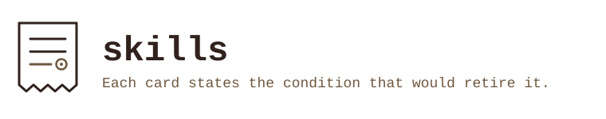

<p>
  <picture>
    <source media="(prefers-color-scheme: dark)" srcset="assets/banner-dark.svg">
    
  </picture>
</p>

# `skills`

Claude Code skills for mistakes that report success. Most come from a failure seen in real work: a pull that quietly rewrote commits, a test that passed over code that never ran, a deploy check that confirmed a deploy that had not landed. Two, `im-down` and `im-up`, were designed on purpose rather than written after an incident. Any Claude Code user can hit these failures. The [admission policy](ADMISSION.md) came after many of the skills were published, and a [triage against it](dispositions/2026-08-15-S295-admission-triage.md) found that most of them do not yet meet all four of its questions on recorded evidence. Each skill's `EVIDENCE.md` says where it stands.

## Install

Run these two commands one at a time. A paste of both in one block is read by Claude Code as a single malformed URL.

```text
/plugin marketplace add https://github.com/MrBinnacle/skills.git
```

```text
/plugin install mrbinnacle-engineering
```

The other plugins are `mrbinnacle-orchestration` and `mrbinnacle-meta`. Or install everything with `npx skills add MrBinnacle/skills`.

The cards appear after `/reload-plugins`. If Claude Code reports the reload as pending, run `/reload-plugins --force`. A new `claude` session in the same profile also loads them. The plugin docs at https://code.claude.com/docs/en/discover-plugins.md state this behaviour (read 2026-10-06).

Confirm what you installed with `claude plugin list`. It reports the installed plugins and their versions.

Shell form, same source:

```bash
claude plugin marketplace add https://github.com/MrBinnacle/skills.git
claude plugin install mrbinnacle-engineering
```

The HTTPS clone URL is what this README publishes. The GitHub shorthand `MrBinnacle/skills` is also a documented CLI source; on a machine with no working SSH key for github.com it can fail with `git@github.com: Permission denied (publickey)`, which is what a cold install of v3.0.1 recorded. Issue #333 recorded that failure.

Verified forms, Claude Code 2.1.287, 2026-10-02, from a clean `CLAUDE_CONFIG_DIR` with no SSH key:

- interactive `/plugin marketplace add https://github.com/MrBinnacle/skills.git`
- shell `claude plugin marketplace add https://github.com/MrBinnacle/skills.git`
- shell `claude plugin install` of all three plugins, at 3.0.1

The cold-install transcript is in the pull request that changed this section (#340).

Each skill adds one line to every session: about 45 to 65 tokens, measured by `skill-harness skill audit` on 2026-09-22. The rest loads only when it is used. The three marked "by hand" cost nothing until you run them.

## What's in it

**mrbinnacle-engineering**

| Skill | Use it when |
|---|---|
| `pull-rebase` | You pull with `pull.rebase` on, and something else records your commit IDs. |
| `stale-deploy` | You confirm a deploy by polling a page that may already show the new text. |
| `mocked-stub` | A test mocks a helper that is only a stub in production. |
| `vacuous-check` | A success check only asks whether the output is non-empty. |
| `clirunner-env` | A test overrides environment variables to stop a real call. |
| `pretooluse-prose` | A command guard might block prose that mentions the command. |
| `halt-as-deliverable` | Your own gate stops the work, and the stop is the result. |
| `closure-mode` (by hand) | You reach a boundary with a checklist to run. |
| `im-down`, `im-up` (by hand) | You end a session and start the next one from written state. |

**mrbinnacle-orchestration**

| Skill | Use it when |
|---|---|
| `subagent-handback` | You send work to a subagent and need to check what comes back. |
| `decision-rights` | You write a handoff, plan or prompt that someone else will act on. |
| `disposition-schema` | You run parallel reviews that must be compared. |

**mrbinnacle-meta**

| Skill | Use it when |
|---|---|
| `dead-predicate` | A hook or router stays silent and you need to know why. |

## What comes with each skill

You would not ship code that runs on every request without tests. A skill runs in every session you have. So each one here comes with:

- **Test cases** (`evals/evals.json`), so you can check it still works on your model instead of assuming it does.
- **An evidence record** (`EVIDENCE.md`): the real failure it came from, and what has been measured. So you know why it is there.
- **A retirement condition**: the change that would make it unnecessary. So you know when to take it out.

Controlled tests, with and without each skill, run in [skill-harness](https://github.com/MrBinnacle/skill-harness). The first, on `pull-rebase`, completed on 2026-09-03 and returned `CANT_TELL_YET`: the failure did not occur in either arm, so the run could not tell whether the skill helps. No second run is funded yet. The [evidence record](skills/engineering/pull-rebase/EVIDENCE.md) has the details. No skill claims a measured benefit yet.

## How skills get in and out

A new skill gets in only if it passes the [admission policy](ADMISSION.md). It leaves when a test finds no benefit, or when a model or Claude Code change makes it unnecessary. [RETIRED.md](RETIRED.md) lists every one that has left, with its evidence. Candidates wait in [`_quarantine/`](_quarantine/README.md).

The full evidence table, the card forms and the admission detail are in [CATALOG.md](CATALOG.md). Security commitments are in [SECURITY.md](SECURITY.md).
